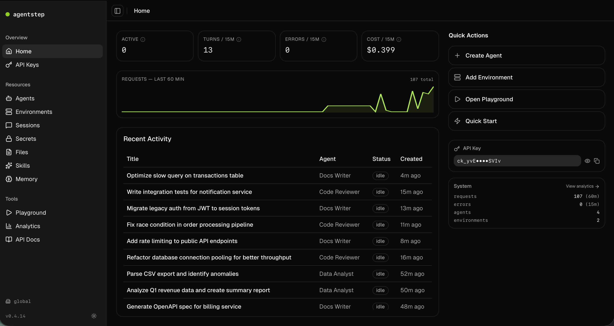
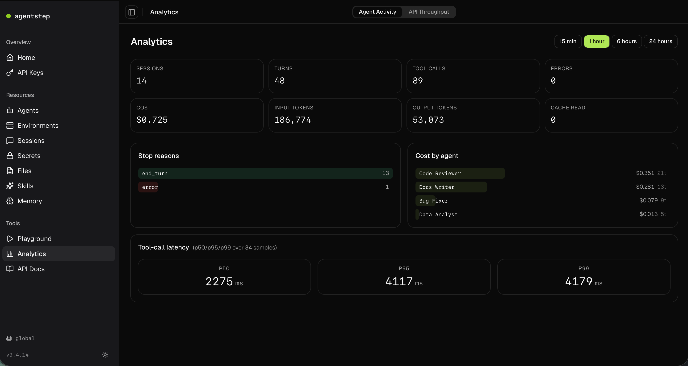
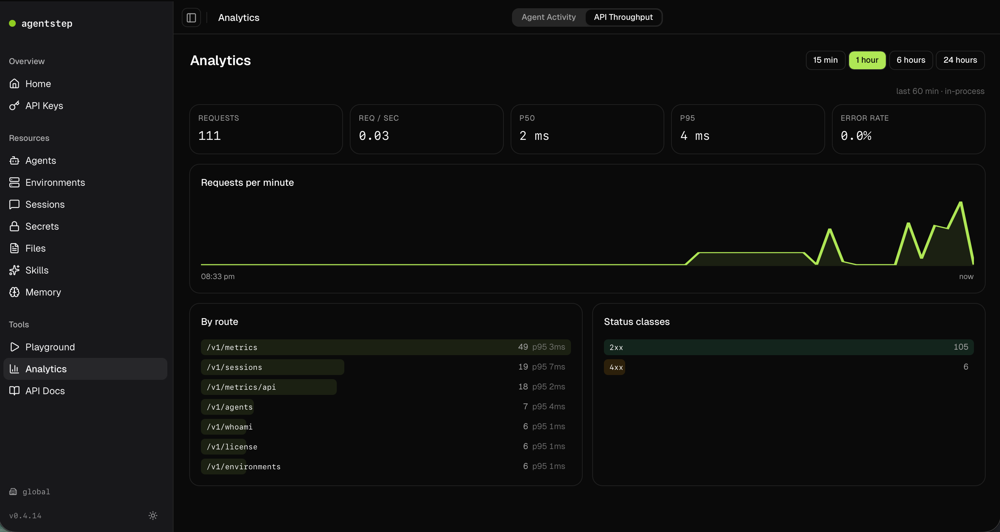

# AgentStep Gateway

**Self-hosted, open-source, Anthropic Managed Agents-compatible.**
Run AI coding agents in sandboxed environments — any engine, any sandbox, one API.

[](https://www.npmjs.com/package/@agentstep/gateway)
[](LICENSE)

<p align="center">
  
</p>
<p align="center">
  
  
</p>

## Why AgentStep Gateway?

- **Drop-in alternative to Anthropic's Managed Agents API** — same resource model (agents, vaults, sessions, environments), same SSE event stream. Point any HTTP client at `http://localhost:4000/v1` with the `anthropic-beta: managed-agents-2026-04-01` header and you get the same API surface. (The `@anthropic-ai/sdk` npm package doesn't yet expose the managed-agents beta endpoints — use raw `fetch` or curl until they land upstream.)
- **Runs on your infrastructure** — prompts, code, and outputs stay local. SQLite storage. No telemetry without consent.
- **Any agent engine** — Claude, Codex, OpenCode, Gemini, Factory, or sync-and-proxy to Anthropic's hosted Managed Agents. One config change to switch.
- **11 sandbox providers** — Docker, Podman, Apple Container, Apple Firecracker, Sprites, E2B, Vercel, Daytona, Fly, Modal, MVM.
- **Ships with a web UI** — React dashboard at `localhost:4000` for chat, observability, vault management. Same API as the CLI, nothing hidden.
- **Vault-encrypted secrets at rest** — AES-256-GCM per-instance key, stored in `.env`, never returned over the API in plaintext.

## Quick Start

### Try it now (zero install)

```bash
npx @agentstep/gateway quickstart
```

### Install globally

```bash
npm install -g @agentstep/gateway
gateway serve                # UI + API at http://localhost:4000
# or
gateway quickstart           # interactive: create agent, env, session, chat
```

### From source

```bash
git clone https://github.com/paulmeller/gateway.git
cd gateway
npm install
npm run dev                  # Hono server on :4000 with hot reload
```

### With Claude Code

```bash
git clone https://github.com/paulmeller/gateway.git
cd gateway
claude
> /setup-gateway
```

The `/setup-gateway` skill walks through prerequisites, secrets, server boot, and your first session.

Prerequisites: Node.js 22+, and at least one of `ANTHROPIC_API_KEY`, `OPENAI_API_KEY`, `GEMINI_API_KEY`.

## Anthropic Managed Agents compatibility

The gateway implements the public Anthropic Managed Agents API shape — `/v1/agents`, `/v1/vaults`, `/v1/environments`, `/v1/sessions`, `/v1/sessions/:id/events`, and the SSE `/stream` endpoint. You can:

1. **Run agents entirely locally.** Pick a container provider (docker, apple-container, …), a claude / codex / gemini / … engine, and the gateway manages sandboxes + turns.
2. **Sync-and-proxy to Anthropic's hosted managed agents.** Create an environment with `provider: "anthropic"` — the gateway syncs your agent config (tools, MCP servers, model) to Anthropic, creates a hosted session, and proxies execution traffic. Best of both worlds: Anthropic manages the sandbox; your config lives locally.

See [`docs/anthropic-integration.md`](docs/anthropic-integration.md) for the sync protocol details.

## CLI

```bash
gateway quickstart                     # one-command agent + env + session + chat
gateway serve [--host 127.0.0.1]       # start the server (loopback by default)
gateway agents create --name bot --model claude-sonnet-4-6
gateway environments create --name dev --provider docker
gateway sessions create --agent <id> --environment <id>
gateway chat <session-id>              # interactive chat (markdown, tool output)
gateway db reset                       # wipe local SQLite (with safety checks)
gateway config set <key> <value>       # CLI config
```

All commands accept `--remote <url>` (talk to a remote gateway) and `-o json` (structured output).

## Security posture

- **Loopback bind by default.** `gateway serve` binds `127.0.0.1`. Use `--host 0.0.0.0` to expose on the network — the server prints a warning, and the UI refuses to inject the auto-login API key for non-loopback clients.
- **Vault encryption.** Values are AES-256-GCM encrypted with a per-instance key in `.env`. The API never returns plaintext vault entries.
- **Settings masking.** `/v1/settings/:key` returns `sk-ant••••••••••Leak`-style masks for secret-shaped keys.
- **OAuth-token detection.** Pasted `sk-ant-oat*` tokens are remapped to `CLAUDE_CODE_OAUTH_TOKEN` (and blocked entirely when using the Anthropic provider, which requires a real API key).

Found a security issue? See [`SECURITY.md`](SECURITY.md).

## Packages

| Package | Published | Description |
|---------|-----------|-------------|
| [`@agentstep/agent-sdk`](https://www.npmjs.com/package/@agentstep/agent-sdk) | npm | Core engine — backends, providers, DB, session orchestration, vault crypto |
| [`@agentstep/gateway`](https://www.npmjs.com/package/@agentstep/gateway) | npm | CLI (`gateway`) — single-file bundle with UI embedded |
| `@agentstep/gateway-ui` | source only | React + shadcn/ui web app (inlined into the CLI bundle) |
| `@agentstep/gateway-hono` | source only | Hono server adapter (powers `gateway serve`) |
| `@agentstep/gateway-fastify` | source only | Fastify server adapter (reference implementation) |
| `@agentstep/gateway-next` | source only | Next.js integration (reference implementation) |

The server packages are reference implementations. The hosted product ([agentstep.com](https://www.agentstep.com)) uses `@agentstep/agent-sdk` directly — same handler functions, same event model.

## Development

```bash
npm install          # install deps
npm run dev          # Hono dev server on :4000, hot reload
npm test             # 518 tests across agent-sdk + gateway
npm run typecheck    # tsc --noEmit
npm run build:ui     # rebuild React UI → inline into CLI bundle
```

## License

[Apache 2.0](LICENSE). See [`CONTRIBUTING.md`](CONTRIBUTING.md) if you want to send a patch.
